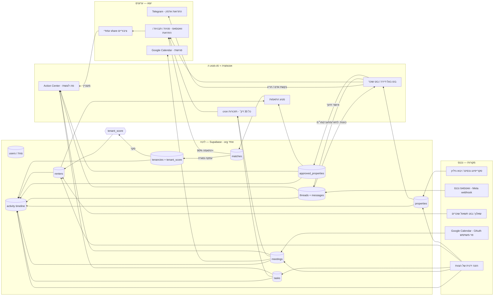

# מפה לוגית — rent360 כ"מערכת-על" (super-CRM)

המטרה: מערכת אחת שבולעת כל CRM — מקורות-מידע נכנסים, ליבה אחת מחברת הכל, וכל פעולה יוצאת חזרה
לערוצים (וואטסאפ / Google / share). למטה: זרימת-המידע, גרף-הישויות, ושכבת-השאיפה (מה להוסיף).

---

## 1. תרשים זרימה — מה שואב לאן



---

## 2. גרף הישויות (מה מחובר למה)
- **organization → users(צוות)** — שורש רב-דיירות; כל שורה נושאת `org_id`.
- **properties → approved_properties → tenancies** — מסלול נכס: גולמי → מאושר → הושכר.
- **renters** — פרופיל שוכר (שאלון, העדפות, embedding, וטינג).
- **matches** = renter ⨯ property (ציון 0–100, `renter_notified_at`, פסילות). הצומת המרכזי של ההתאמה.
- **threads → messages** — כל שיחת וואטסאפ; מקושרת ל-property/renter (לפי `audience`), `assigned_to` לאיש צוות.
- **tasks / meetings / activity** — שכבת המשרד; כל אחד **מקושר פולימורפית** לישות (property/renter/thread/tenancy) ול-`assignee`.
- **tenancies → tenant_score** — עסקה סגורה → סקר תקופתי → ציון דייר → מזין דירוג שוכרים.
- צמתים תומכים: `whatsapp_templates` (שער שליחה), `whatsapp_suppression` (opt-out), `settings` (משקלים/שעות-שקט), `google_connections` (טוקני יומן).

**כלל-זהב:** מכל ישות אפשר לקפוץ לכולן — נכס↔שוכר↔שיחה↔משימה↔פגישה↔פעילות.

---

## 3. הזרימות המרכזיות (טריגר → תוצאה)
1. **משפך הגיוס:** נכס → פנייה (וואטסאפ) → שיחה → בוט אוסף+סוגר → `approved_properties` → חישוב `matches`.
2. **משפך ההתאמה:** match≥90% → התראת שוכר (תבנית+share) → "מעוניין" → Action Center → סגירה → `tenancy` → סקר → tenant_score → דירוג.
3. **לולאת הכוונות:** הבוט מזהה כוונה (לחזור/מתעניין/מו״מ) → נתיב ב-Action Center + `callback_at` → cron → תזכורת וואטסאפ לצוות.
4. **לולאת המשרד:** משימה/פגישה (אחראי+דדליין) → cron → תזכורת וואטסאפ לאחראי → סימון "בוצע" → רישום ב-activity.
5. **לולאת הפעילות:** כל אירוע (הערה/שיחה/שינוי-סטטוס/משימה) → `activity` על הישות → טיימליין מאוחד.

---

## 4. נקודות אינטגרציה (pull / push)
| ערוץ | כיוון | מה |
|---|---|---|
| Meta WhatsApp | נכנס+יוצא | webhook נכנס → threads; שליחת תבניות/טקסט/התראות החוצה |
| Google Calendar | דו-כיווני | OAuth פר-משתמש → meetings (יצירה/סנכרון) |
| Telegram | יוצא | התראות אדמין (handoff/דחוף) |
| סקרייפינג / גיליון | נכנס | properties (idempotent דרך inbound_events) |
| OpenAI | פנימי | בוטים, embeddings, RAG, תקצירים |
| עמודי share | יוצא (ציבורי) | דף נכס לשוכר + לכידת "מעוניין" |

---

## 5. שכבת-השאיפה — מה להוסיף כדי "להכניס כל CRM לכיס"
מה שכבר יש מסומן ✅; מה שיהפוך אותה ל-super-CRM:
- ✅ לידים+שיחות+התאמות+תזכורות+משימות+פגישות+יומן-פעילות+צוות.
- ➕ **Contacts מאוחד** — גרף-אנשים אחד (בעלי דירות, שוכרים, ספקים, מפנים) במקום ישויות נפרדות.
- ➕ **Pipeline / Deals (Kanban)** — שלבי-עסקה גלויים: ליד → שיחה → מאושר → הותאם → צפייה → נסגר, עם גרירה.
- ➕ **Email (Gmail) כערוץ נוסף** לצד וואטסאפ — omni-inbox אחד (וואטסאפ+מייל+שיחות).
- ➕ **מסמכים/חוזים** — כספת קבצים מקושרת לעסקה (אנחנו מלווים חתימה, לא מנסחים).
- ➕ **אנליטיקה ודוחות** — המרת-משפך, זמן-להשכרה, ביצועי-סוכן, ROI לפי מקור-ליד.
- ➕ **מנוע אוטומציות (if-this-then-that)** — חוקים שהצוות מגדיר, במקום cron קשיח.
- ➕ **שכבת AI-insights** — דייג'סט יומי, "הפעולה הבאה הכי טובה", ניקוד-ליד, שיפור-עצמי.
- ➕ **מחזור-חיי דייר** — סקרים → tenant_score → תג-אמון לשוכר (התחלנו ב-tenancies).
- ➕ **PWA/מובייל** — אפליקציה לצוות בשטח + נוטיפיקציות push.

עיקרון מנחה: **כל מקור-מידע חדש נכנס לליבה, ומשם הופך אוטומטית לפעולות בצוות** (Action Center / משימות / תזכורות) — זה מה שהופך אותה ממאגר ל"מערכת-על" שעובדת בשבילך.
```
